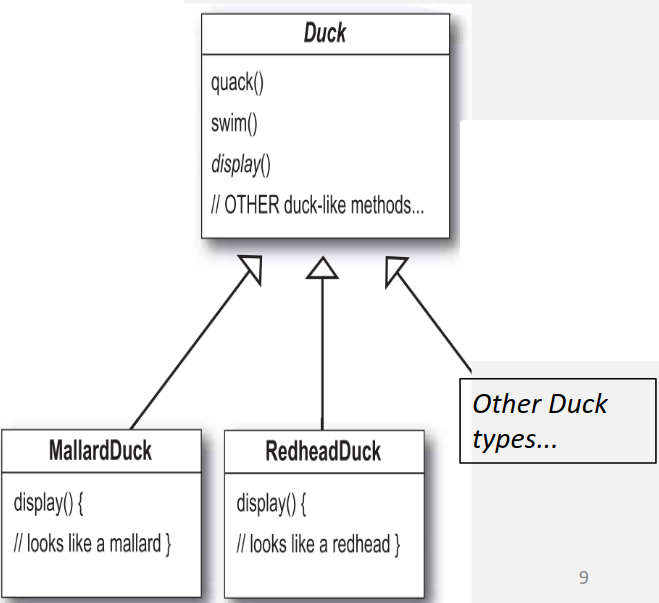
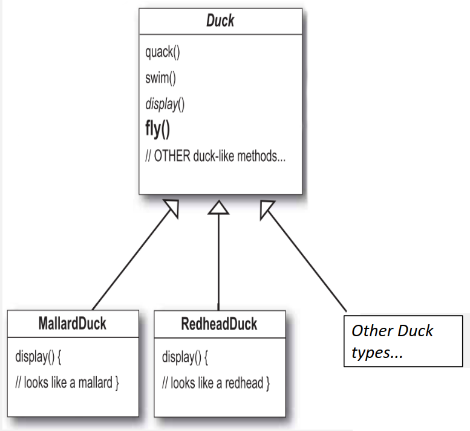
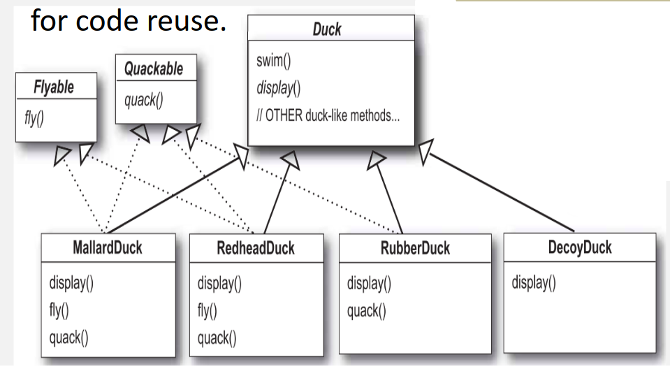

# Teórica 10

## *Design Patterns*

### *Patterns*

- Baseia-se na ideia que alguém já terá resolvido os nossos problemas;
- São soluções comprovadas para problemas comuns e conhecidos;
- Emergem da experiência de outros *devs* para resolver problemas de *design*;
- A melhor maneira de usar padrões é encher o cérebro com eles para, em seguida, reconhecer o local nos nossos *designs* em que podemos aplicá-los;
- Ao invés de reutilização de código, os padrões permitem a **reutilização de experiência**;
- São:
  - Uma descrição textual de uma solução genérica para um problema recorrente num dado contexto;
  - Um *chunk* pré-definido e construído para servir uma dada situação;
  - Um pacote de decisões de *design* que podem ser reutilizadas como um conjunto.
- Existem em níveis diferentes:
  - Padrões de Sistema (estilo arquiteturais);
  - Padrões de *Design*;
  - Padrões de Código.
- Não são perfeitos para todos os problemas;
- A sua habilidade de efetuar uma separação entre as coisas que alteram e as que não alteram, revela-se muito útil para a implementação de sistemas;
- **3 tipos**:
  - Criacionais;
  - Estruturais;
  - Comportamentais.
- Vamos descrever dois padrões:
  - *Strategy* (estrutural);
  - *Observer* (comportamental);
  - *Decorator* (estrutural).

### *Strategy Pattern*

- Veja-se o exemplo da implementação de patos.
  - Todos os patos são capazes de *quack* e de *swim*, assim, a superclasse **Pato** deve tratar do código de implementação;
  - O método `display()` é abstrato, visto que todos os patos têm aparências diferentes;
  - Cada subtipo de pato é responśavel por implementar o seu próprio comportamento de `display()`.

- Se quisermos adicionar um novo atributo, por exemplo, o método `fly()`, este será adicionado à classe do topo, visto que todos os patos devem ser capazes de ter esse método.
  - Todas as subclasses vão herdar o método `fly()` por **herança**.

- No entanto, se considerarmos patos de borracha, estes não devem ser capazes de voar. 
  - Assim, temos de dar *override* ao método `fly()`;
- O mesmo acontece com o método `quack()`;
- Assim, devemos escrever esses métodos diretamente dentro da subclasse *RubberDuck*;
- O uso da herança para reutilização, neste caso, não foi bom para a manutenção da aplicação;
- **A herança não é bom mecanismo quando são necessárias atualizações**;
  - Pode gerar duplicação de código entre subclasses;
  - Alterações no código podem fazer alterações entre subclasses não previstas.

- Uma possível estratégia, é separar os métodos `fly()` e `quack()`, visto que estes podem variar entre patos;
  - O uso de interfaces é mau para a reutilização de código.
- Quando um método precisa de ser modificado, é preciso verificar todas as subclasses.

**Princípio de *design* 1**: Devemos identificar os aspetos da aplicação que variam e separá-los dos restantes.

**Princípio de *design* 2**: Devemos programar para uma interface, não para a implementação.

**Princípio de *design* 3**: Devemos favorecer a composição ao invés da herança.

- Este padrão define uma família de algoritmos, encapsula cada um deles e permite a troca entre eles;
- Deixa que que o algoritmo varie independentemente da utilização que o cliente lhe pretende dar.

### *Observer Pattern*

- Veja-se o exemplo de uma aplicação de monitorização de meteorologia:
  - **Problema**: se novos *Displays* são adicionados, então precisamos de atualizar os dados da meteorologia;
  - **Oportunidade**: a informação/interface necessária entre *displays* é semelhante.
- Este padrão define uma dependência de um para muitos entre objetos;
- Quando o estado de um objeto altera, todos os seus dependentes são notificados e atualizados de forma automática.

### *Decorator Pattern*

**Princípio *open-closed***: Um módulo ou classe deve ser aberto à sua extensão, mas fechado à modificação.

- Este é o princípio mais importante do *design* Orientado a Objetos;
- Os módulos devem ser escritos de forma a poderem ser extendidos, sem serem modificados;
- Devemos querer alterar o que os módulos fazem sem ser necessário alterar o seu código;
- o *decorator pattern* coloca responsabilidades adicionais a um objeto de forma dinâmica;
- Providencia uma alternativa flexível para *subclassing* de forma a extender as funcionalidades.