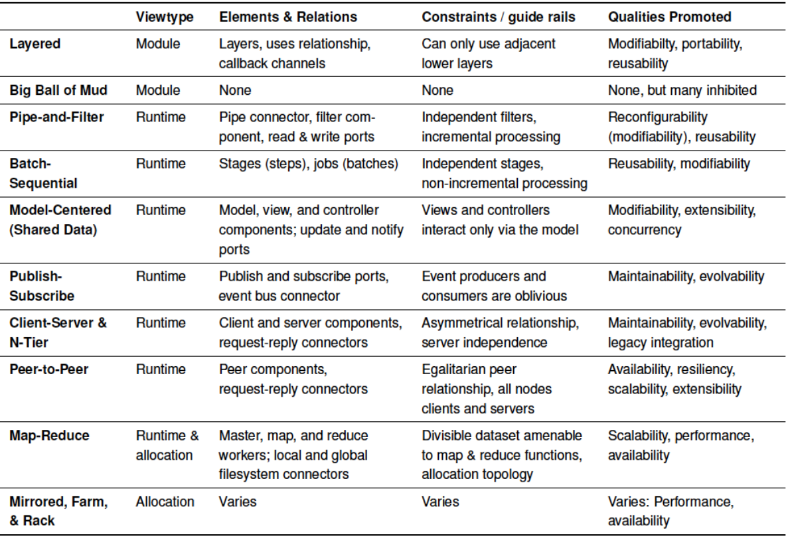
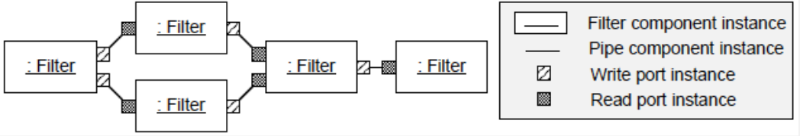
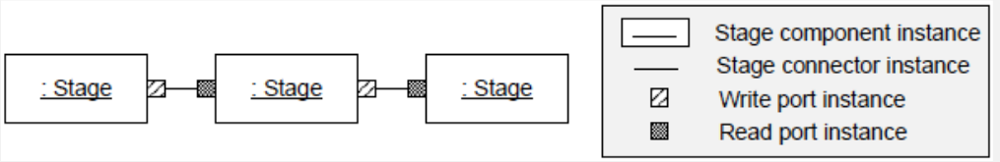
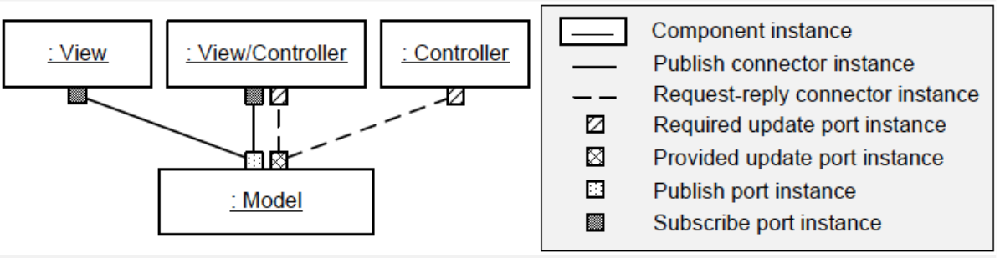
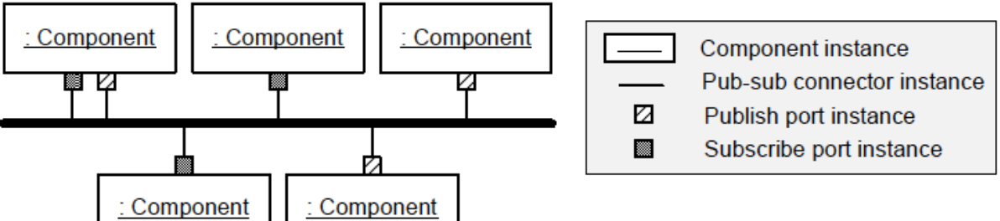
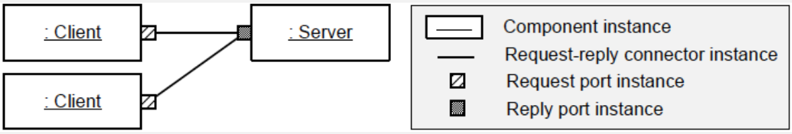
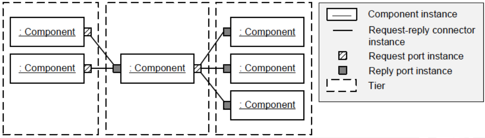

# Teórica 11

## Estilos de Arquitetura

Consiste em:

- Conjunto de tipos de componentes (p.e. processos, procedimentos, etc...) que executam alguma função em *runtime*;
- Um *layout* topológico de componentes que demonstram as suas relação em *runtime*;
- Um conjunto de restrições semânticas;
- Um conjunto de conetores (p.e. *data streams*, *sockets*, etc...) que mediam a comunicação entre componentes.

Um sistema que se conforme a um dado estilo, então deve usar esses tipos, o que irá restringir o *design space*.

### Restrições

- Podem atuar como guias que apontam para onde queremos levar o sistema;
- Podemos pensar num estilo como um conjunto pré-fabricado de restrições a serem reutilizadas;
- A consistência trazida acerca das restrições de estilo podem encorajar a evolução clara do sistema, o que poderá tornar a manutenção mais fácil;
- A comunicação entre *devs* é melhorada.

### *Platonic vs Embodied*

- Um estilo arquitetónico *platonic* é uma idealização;
  - Geralmente, só se encontra em livros e muito raramente em *source code*.
- Um estilo arquitetónico *embodied* existe em sistemas reais;
  - Por vezes viola as restrições estritas encontradas em estilos platónicos.
- Por vezes, podemos encontrar versões *embodied* do estilo em que servidores, de forma ocasional, enviam dados para os clientes;
- Dependendo da forma de implementação, poderá resultar num servidor que depende dos clientes.

### *Patterns vs Styles*

- *Design patterns* são em menor escala que os estilos arquitetónicos;
- Os *patterns* podem aparecer em qualquer local no *design* e podem aparecer múltiplos *patterns* no mesmo *design*;
- Um sistema, usalmente, tem um único estilo arquitetónico dominante;
- Se um sistema tiver um estilo arquitetónico cliente-servidor, devemos esperar ver um componentes de cliente e servidor nas vistas de *design top-level*;
- O sistema também pode empregar *patterns* arquitetónicos, tal como um *REST pattern*.

### Catálogo de Estilos

### Estilo de Camadas

- O elemento essencial é a camada;
- A relação baseia-se num *uses*, ou seja, uma especialização da relação de dependência;
- Consiste numa *stack* de camadas;
- Cada camada atua como um máquina virtual para as camadas superiores de forma a ordenar as formas em DAG;
- Num estilo de camadas simples, cada camada apenas pode usar a camada diretamente abaixo;
- Atributos de qualidade promovidos: modificabilidade, portabilidade e reutilização;
- Pode variar muito entre a sua forma *platonic* e a sua forma *embodied*;
- Na prática, este estilo podem violar as suas restrições;
  - Podemos ver camadas a saltar outras ou camadas inferiores a utilizar camadas superiores;
  - As camadas inferiores podem comunicar de forma segura com camadas superiores se usarem um mecanismo de *callback*.
- "*Lasagna Code*" refere-se a um programa estruturado que utilize este estilo.

### *Big ball of mud style*

- Não tem um estrutura evidente;
- É típica a partilha de informação de forma pormíscua, para permitir que a extensão de estruturas de dados se tornem efetivamente globais;
- Reparações e manutenção são convenientes e assemelham-se a remendos grosseiros, ao invés de refatorações elegantes;
- Não é feito qualquer esforço para forçar qualquer tipo de integridade conceptual ou consistência (*spaghetti code*);
- Estes sistemas têm má manutenção e extensabilidade;
- Este estilo é um estratégia de engenharia suficientemente boa.

### *Pipe & Filter Style*

- *Flow* de dados através de *pipes* para filtrar o trabalho nos dados;
- A rede *pipe-and-filter* está a processar dados de forma contínua e incremental;
- Consiste em 4 elementos:
  - *Pipes*;
  - Filtros;
  - Portas de leitura;
  - Portas de escrita.
- Um filtro lê um *input* das portas de *input*, efetua algum processamento e escreve o *output* nas portas de *output*;
- Repete o processo até chegar à altura de parar;
- Os filtros podem enriquecer, refinar e transformar os dados;
- Cada filtro aplica uma função ao seu *input*;
- Os *pipes* apenas devem transportar dados num direção, sem trocar e ordenados;
- Os ciclos na rede são raros e por vezes proíbidos;
- Os filtros não devem interagir uns com os outros, até mesmo indiretamente, exceto através de *pipes*;
- Um filtro lê o *input* de forma incremental e, enquanto processa esse *input*, incrementalmente escreve o seu *output*.

### *Batch-Sequential Style*

- Dados andam de *stage* em *stage*;
- Cada *stage* completa todo o seu processamento antes de escrever o seu *output*;
- Os dados podem andar entre *stages* numa *stream*, mas é mais vezes escrito num ficheiro em disco;
- Tem restrições semelhantes ao estilo *pipe-and-filter*;
- Cada *stage* é similarmente independente;
- Um *stage* depende dos dados que recebe;
- Os *stage* não interagem entre eles, exceto através das *streams* ou ficheiros de *input* e *output*. 

### *Batch-Sequential vs Pipe & Filter*

- Ambas decompõem a tarefa numa sequência fixa de computações, interagindo apenas através dos dados.
- ***Batch-Sequential***:
  - Grão grosso;
  - Grande latência;
  - Acesso externo ao *input*;
  - Não tem concorrência;
  - Não tem interação.
- ***Pipe & Filter***:
  - Grão fino;
  - Resultados começam o processamento;
  - *Input* localizado;
  - Possível concorrência;
  - Possível interação.

### *Model-Centered Style*

- Componentes independentes interagem com um modelo central (*data store*), ao invés de interagirem uns com os outros;
- Todos os sistemas *model-centered* têm um componente *model* e múltiplos componentes *views*, *controller* ou *view-controller*;
- O estilo é relacionado a múltiplos *design patters*, incluindo o *document-view*, o MVC e o *observer*.

- As *views* e os *controllers* dependem apenas do *model* e não umas das outras;
- A modificabilidade é melhorada porque o produtor e o consumidor de informação estão separados;
- O sistema é extensível, uma vez que *views* e *controllers* inesperados são facilmente adicionados;
- Pode ser fácil de gerir e persistir o estado, visto que é centralizado no componente *model*;
- A concorrência pode ser promovida visto que as *views* e os *controllers* podem correr nas suas próprias *threads* ou processos;
- Este estilo é útil quando não sabemos a configuração futura do sistema.

### *Publish-Subscribe style*

- Componentes independentes publicam eventos e subscrevem-se a eles;
- A componente de publicação é ignorante da razão principal quando um evento é publicado;
- Uma componente de subscrição não sabe o porquê ou quem publicou o evento.

- Este estilo define as portas de publicação e de subscrição e um conetor (um *event bus connector*);
- Qualquer tipo de componente pode publicar/subscrever eventos desde que utilize uma porta de publicação/subscrição;
- Um componente pode publicar um evento e múltiplos componentes podem subscrever o evento;
- O *event bus connector* entrega eventos:
  - Publicadores confiam que os eventos são entregues ao subscritores;
  - Subscritores confiam que recebem os eventos para os quais estão subscritos.
- Produtores e consumidores estão separados;
- O sistema é mais mantível e envolvível.

### *Client-server style & N-tier*

- Clientes pedem serviços aos servidores de forma síncrona;
- O cliente pode pedir ao servidor que faça o trabalho;
- A comunicação é iniciada pelos clientes, não pelo servidor;
- O servidores não sabe a identidade do cliente até ser conectado por ele;
- Clientes devem saber a identidade do servidor ou como procurar por ele.

- Tem múltiplos pontos de variação:
  - Conetores podem ser síncronos ou assíncronos;
  - Podem existir limites quanto ao número de clientes ou servidores;
  - Conetores podem manter ou não manter estado;
  - A topologia do sistema pode ser estática ou dinâmica.
- Outra variante é o estilo *N-Tier*:

- Utiliza duas ou mais instâncias do estilo *client-server* de forma a ter uma série de *tiers*;
- Os pedidos devem seguir em apenas 1 direção;
- Um caso comum é um *3-tier system* onde:
  - o *user* intervém como um cliente para a lógica de negócio da camada do servidor;
  - a camada da lógica de negócio do servidor age como um cliente para a camada de persistência do servidor.
- As camadas têm, exclusivamente, funcionalidades de responsabilidade;
- A camada de interface do utilizador é exclusivamente responsável para a interação do utilizador;
- A camada de persistência, exclusivamente, guarda os dados persistentes.

### *Peer-to-peer style*

- Nodos comunicam entre eles como *peers*;
- Relações hierárquicas são proíbidas;
- Cada nodo tem uma habilidade, mas não obrigação, para atuar como o cliente e como servidor;
- O resultado é uma rede de nodos a operarem como *peers*;
- Um nodo pode pedir ou providenciar serviços a cada nodo;
- Os elementos do estilo *peer-to-peer* são semelhantes aos do estilo *client-server*;
- Um conector *peer-to-peer* tem papéis idênticos em ambos, permitindo a ambos que tenham pedidos e respostas;
- É um sistema igualitário, enquanto que o *client-server* é hierárquico.

### *Map-Reduce Style*

- O estilo é apropriado para processar *datasets* grandes (motores de busca e redes sociais);
- Programas simples (de ordenação ou procura) executam lentamente em grandes *datasets*, se for utilizado um único computador;
- Enquanto o número de computadores utilizados aumenta, a probabilidade de um deles falhar também irá aumentar;
- Este estilo ativa a recuperação desses falhanços.

### *Mirrored, rack and farm styles*

- Os estilos arquiteturais anteriores foram desde o módulo até ao *runtime* *viewtypes*;
- Os estilos de alocação *viewtype* são mais prováveis de ser discutidos por engenheiros de redes do que por arquitetos de *software*.
