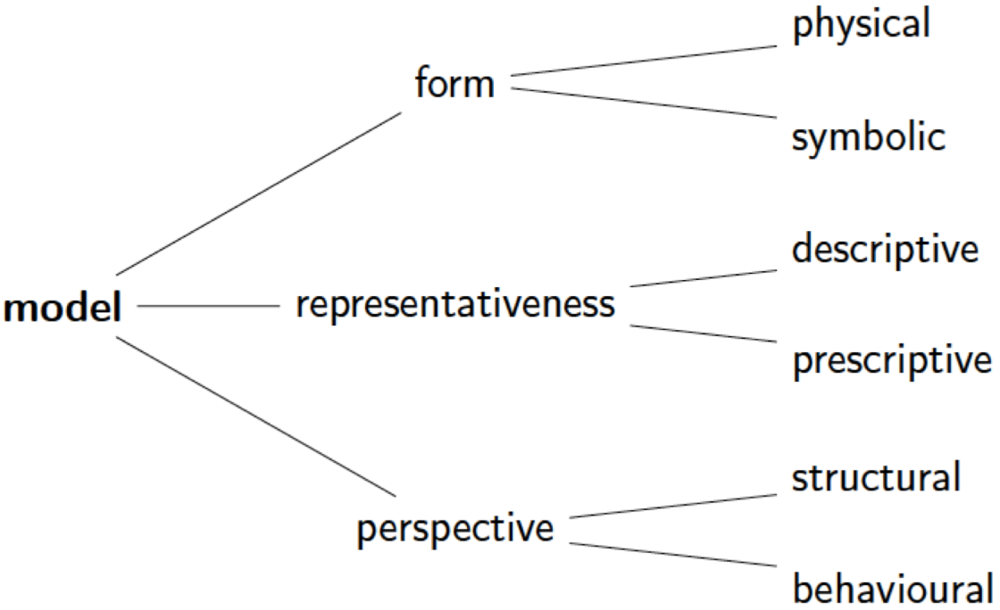
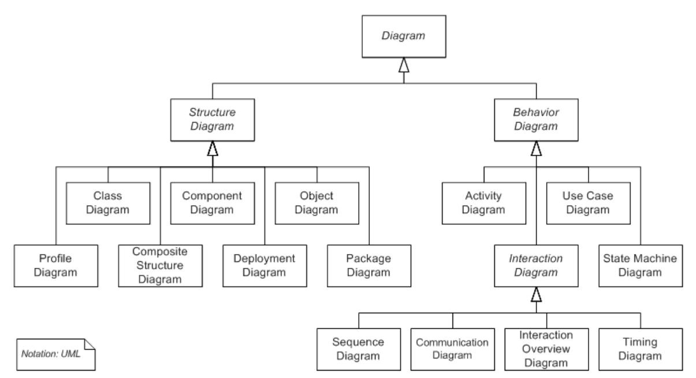
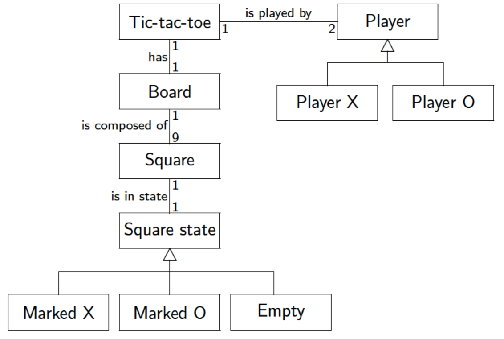
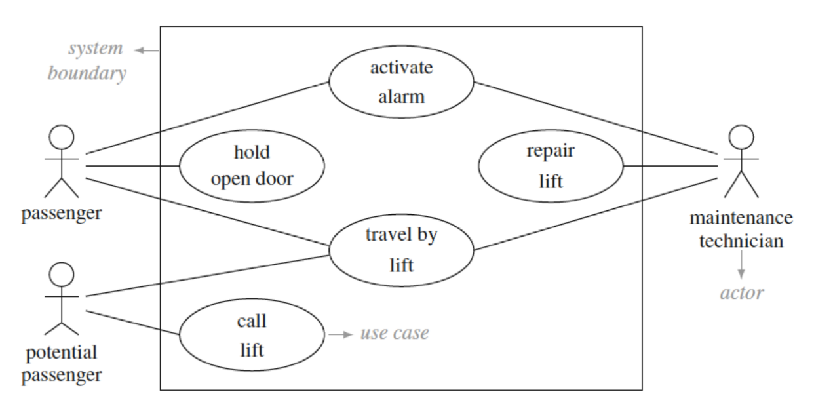
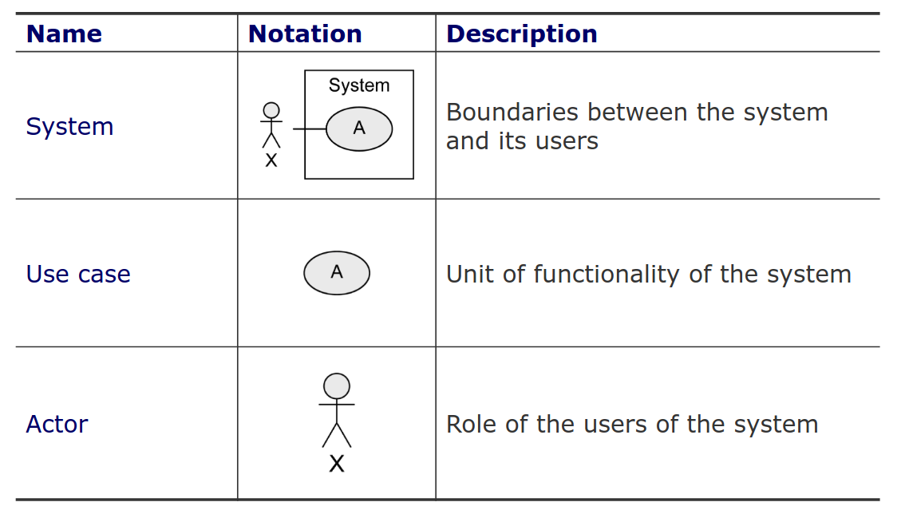
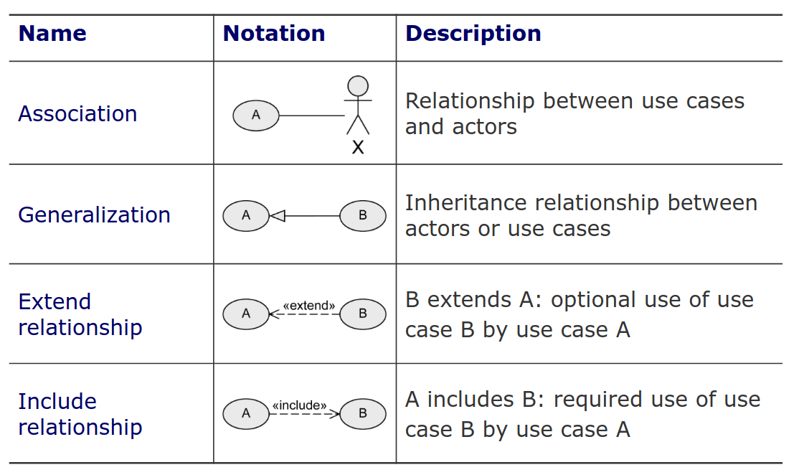
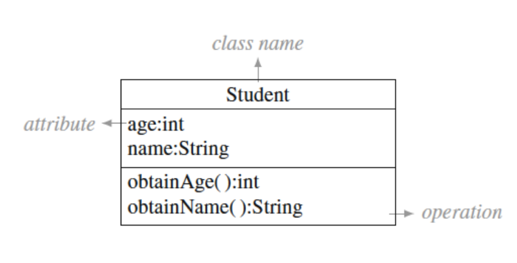
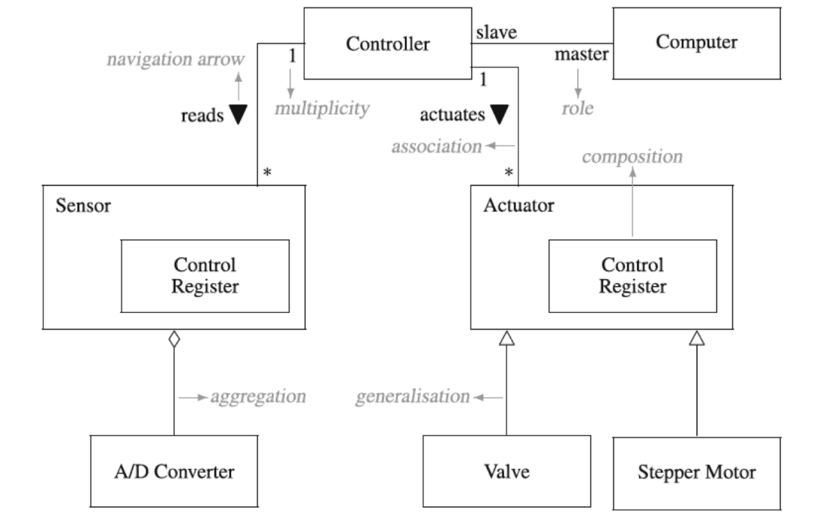
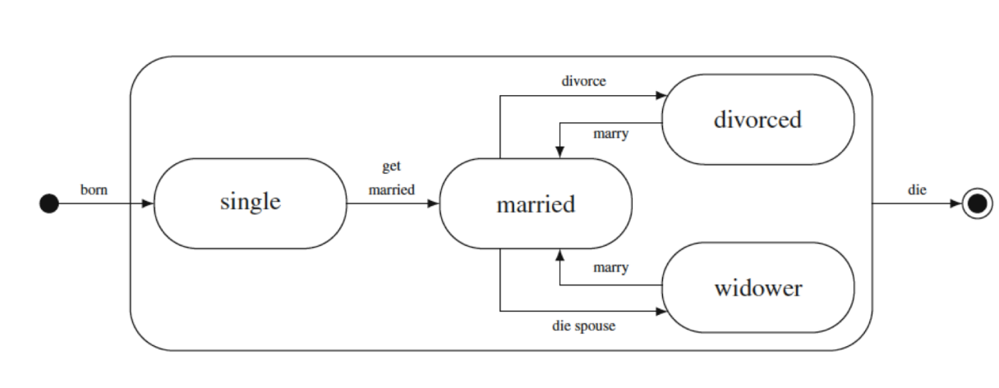
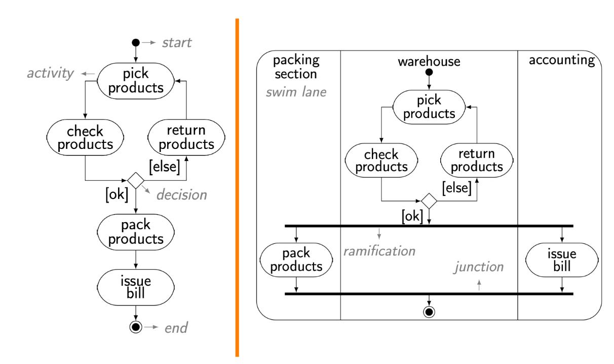

# Teórica 13

## Modelação UML

### Modelação

- Ingrediente essencial em todos os campos de engenharia;
- Tarefa muito criativa;
- Processo de:
  - Identificar conceitos adequados;
  - Selecionar abstrações para construir um modelo que reflita, de forma apropriada, um dado universo de discurso.
- Permite um uso benéfico em termos de custo-eficiência de um modelo, ao invés de objetos ou processos do mundo real para algum propósito;
- Se deve ser útil, um modelo não deve representar todos os aspetos da realidade;
- É relacionado com abstração, simplificação e formalização;
- A operação inversa à abstração é o refinamento e a concretização.

#### Modelos Simbólicos

- Um modelo simbólico (ou matemático) utiliza relações lógicas e quantitativas envolvendo dimensões do sistema;
- Tipicamente, um modelo simbólico não tem em consideração o sistema que representa, sendo, fundamentalmente, arbitrário ou convencional;
- Arbitrariedade é a abstenção de conexões necessárias entre uma forma linguística e o seu significado;
- Uma classe é representada em UML por um retângulo, sendo isto uma convenção pura;
  - A palavra "morango" não tem relação com o fruto em si, sendo uma pura convenção.

#### Propriedades dos Modelos

- **Abstração**: são uma descrição reduzida do sistema;
- **Percetibilidade**: removendo detalhes irrelevantes para um dado ponto de vista, o modelo permite que as propriedades do sistema sejam mais facilmente entendidas;
- **Eficácia**: para as propriedades de interesse, o modelo providencia uma representação *true-to-life* do sistema;
- **Raciocínio**: ajuda à análise e raciocínio correto acerca das propriedades interessantes do sistema, seja através de experimentalização ou de análise formal;
- **Barato**: deve ser muito mais barato do que construír e analisar o sistema.

### UML

- Engenheiros de *software* utilizam UML em 3 modos:
  - *sketches* (*design* informal);
  - *blueprint* (desenvolvimento orientado a modelos);
  - linguagem de programação.
- Em *sketches*, é utilizado para ajudar na comunicação de certos aspetos de um sistema;
- Em *blueprints*, detalha-se artefactos de *design* para produzir código;
- Estes modelos devem conter detalhes suficientes para permitir que os *devs* criem sistemas prontos a correr sem ser preciso tomar decisões de *design*;
- Quando o sistema pode ser especificado em UML, estamos na altura de usar UML como linguagem de programação.

#### Diagramas

#### Essencial

- **Domínio**: descreve o vocabulários, os concetos do domínio e as características dos sistemas que podem ser desenvolvidos para o domínio considerado;
- ***Use Case***: descreve as funcionalidades propostas para um dado sistema;
- **Interação**: apresenta como é que múltiplos objetos ou entidades colaboram, enfatizando o *flow* de controlo e de dados entre eles;
- **Classes**: apresenta um conjunto de conceitos, tipos, classes e as suas respetivas relação;
- **Estado**: Especifica o comportamento de uma entidade ou indica os múltiplos estados (ou modos) sobre os quais passa durante a sua vida;
- **Atividade**: Apresenta o controlo entre atividades de um processo.

##### Modelo de Domínio

##### *Use Cases*

- Não modelam processos/*workflows*;
- Atores não são parte do sistema, logo devem ser colocados fora do retângulo principal (sistema);
- Podemos criar hereditariedade;
- Múltiplos *use cases* pequenos com o mesmo objetivo devem ser agrupados num *use case* mais abstrato;
- Os múltiplos passos de uma funcionalidade não são parte dos *use cases*, não devemos tentar separar os *use cases* deles mesmos;
  - Não se faz decomposição funcional.

##### Diagrama de Classes 

##### Diagrama de Estados

##### Diagrama de Atividade

