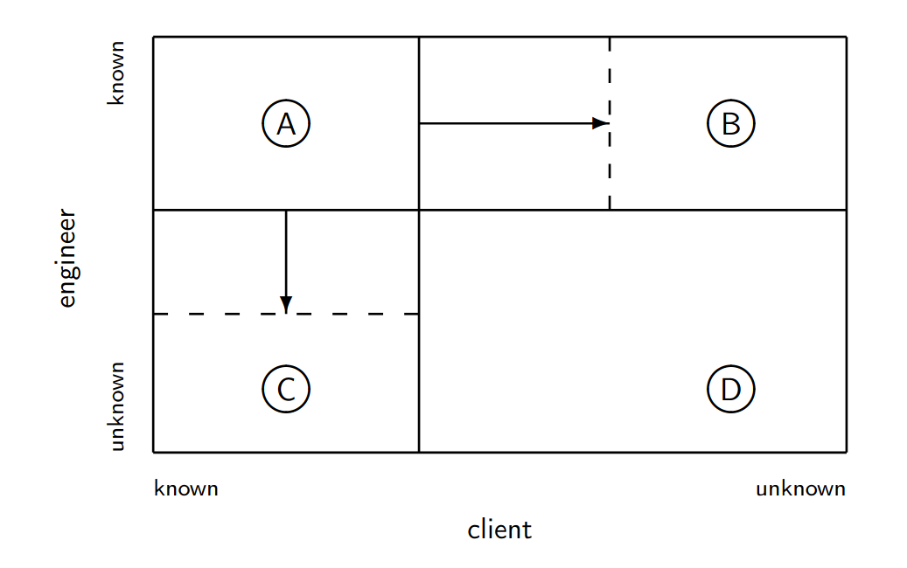

# Teórica 04

## Engenharia de Requisitos

### Atividades

#### *Inception*

- Inicia-se com base na necessidade da existência do sistema;
  - **Sistemas à medida**: Feitos para um grupo específico;
  - **Produtos**: Para o mercado.
- Estuda-se a viabilidade do projeto.
  - "Vai-se gastar $x$ e ganhar $y$".

#### Elicitação ou Levantamento de Requisitos

- Responsável por gerir a forma como os requisitos são obtidos;
- As técnicas de elicitação devem:
  - Identificar as fontes dos requisitos;
  - Ajudar as diversas partes interessadas as descrever corretamente os requisitos.
- Precisa de interações profundas com os *stakeholders*;
- Técnicas de elicitação:
  - Entrevistas;
  - Estudos;
  - Introspeção;
  - Etnografia;
  - *Focus Group*;
  - Trabalho cooperativo;
  - Análise do Domínio;
  - Orientado a Objetos;
  - *Prototyping*;
  - Cenários;
  - Modelação de Objetivos;
  - *Personas*.

#### Elaboração

- Tem como objetivo analisar e classificar os requisitos elicitados, no entanto não pretende tratá-los;
- É comum organizar os requisitos em grupos coesos;
- O analista deverá intervir nos casos em que os requisitos:
  - Não fazem sentido;
  - Apresentação contradições entre eles;
  - São incoerentes;
  - São incompletos;
  - São vagos.

#### Negociação

- A engenharia de requisitos necessita de comunicação e negociação entre os diversos *stakeholders*;
- É inevitável que situações de conflito sejam geradas;
- Assim, é necessário promover mecanismos de negociação entre os *stakeholders*, sendo que o seu resultado poderá ter um grande impacto na aceitação do produto final;
- Outra forma de gerir estes conflitos consiste na adoção de um modelo de prioritização.

#### Documentação

- Os documentos de requisitos servem como referência principal para as seguintes fases do processo de desenvolvimento;
- Um documento de requisitos é organizado de acordo com 2 diferentes perspetivas:
  - **Requisitos de Utilizador**: descreve as expectativas e necessidades dos utilizadores;
  - **Requisitos de Sistema**: estabelece a ligação entre o cliente e a equipa de desenvolvimento.
- A estrtura e formalidade da documentação deverá variar tendo em conta as características do sistema e os processos adotados.

#### Validação

- Tem por objetivo garantir que os requisitos levantados definem o sistema que o cliente deseja;
- É uma atividade de *testing*;
- Esta etapa pode ser realizada em simultâneo com outras atividades características da engenharia de requisitos.

#### Gestão

- O conjunto de requisitos encontra-se em constante mudança, assim, são necessários mecanismos de gestão de forma a avaliar o impacto que as mudanças nos requisitos terão no projeto final;
- Devem rejeitar-se as mudanças que impliquem:
  - Um aumento significativo no custo;
  - O adiamento da data de entrega final;
  - Uma desvalorização do sistema por parte do utilizador.
- Assim, esta atividade pretende fornecer ajuda à equipa de desenvolvimento para identificarem, controlarem e gerirem os requisitos e as suas mudanças.

### Desafios e Problemas

#### Dificuldades

- Pretende caracterizar o problema em mãos com rigor;
- Problemas de comunicação entre os engenheiros de requisitos e os utilizadores são comuns;
- Geralmente, os utilizadores apresentam dificuldades a expressar as suas necessidades reais de uma forma concreta e percetível;
- Em muitas ocasiões, os utilizadores apenas têm uma vaga ideia daquilo que pretendem.

#### Dificuldades e Soluções

- **Dificuldade**: O cliente não é capaz de verbalizar aquilo que pretende;
  - **Solução**: Observar o cliente a utilizar a aplicação em contexto real.
- **Dificuldade**: O cliente não reparou que explicou o problema de forma incorreta até receber a solução que não o resolve;
  - **Solução**: Antes de se iniciar o desenvolvimento de uma possível solução, deve verificar-se se o problema está bem formulado e corresponde à realidade.
- **Dificuldade**: O engenheiro acredita saber mais acerca dos problemas que o cliente em si.
  - **Solução**: Deixar que o engenheiro sinta as dificuldades dos utilizadores em contexto real.

### *Johari Window*

