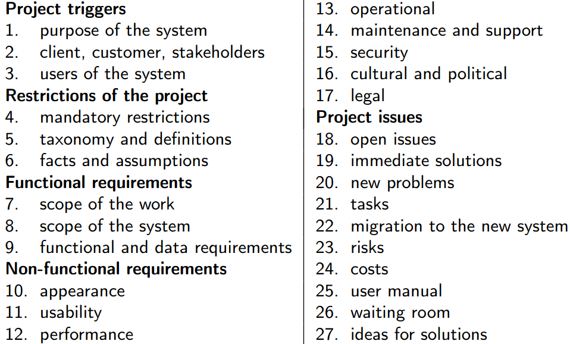
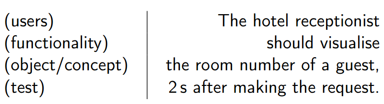
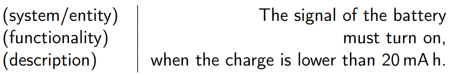

# Teórica 05

## Escrever numa Linguagem Natural

### *Template* para um Documento de Requisitos

#### Necessita de uma estrutura

- A equipa do projeto é responsável pela edição do documento de requisitos;
- É uma atividade que necessita de um grande cuidado, nomeadamente relativo aos detalhes do documento;
- A definição de um *template* genérico para este tipo de documentos revela-se um aspeto importante, tendo em conta a existência de um largo número de engenheiros de sistemas e de projetos;
- Sem um *template*, os graus de liberdade seriam excessivo, permitindo que os documentos fossem muito diferentes de caso para caso;
- Muito útil, sobretudo, para sistemas muito complexos.

#### Estrutura Genérica

### Guias para a Escrita

#### Escrita de Requisitos

- Os requisitos devem ser escritos em linguagem natural;
- Não é expectável que todos os *stakeholders* sejam capazes de interpretar corretamente especificações de requisitos formais;
- A escrita de requisitos precisa de treino e prática, de forma a ser aperfeiçoada.

#### Pontos a Considerar

##### Escrita Técnica

- A escrita de requisitos deve obedecer às regras básicas da escrita técnica;
- A linguagem usada deve ser simples, clara e precisa;
- As palavras escolhidas não devem ter outras possíveis interpretações;
- A escrita técnica deve ser impessoal, objetiva, clara, respeituosa e formal.

##### Formato *standard* para requisitos de utilizador

- **Assunto** que indica o tipo de utilizadores que irá beneficiar desse requisito;
- **Resultado** que se deve alcançar no caso de se cumprir o requisito;
- Um mecanismo que permita efetuar testes ao requisito definido.

##### *User Stories*

- Certos métodos *agile* propõem a adoção de um formato diferente.
- Uma *user story* é uma descrição simples e curta da funcionalidade, feita na perspetiva da pessoa que precisa dela;
- É materializada segundo um conjunto de frases que descrevem o que é que os utilizadores necessitam;
- **Formato**:
  - "**Como um** \<tipo do utilizador\>, **pretendo** \<objetivo\> **porque** \<razão\>.".
- Este formato coloca o utilizador como o foco principal e facilita a identificação das fontes.

##### Formato *standard* para requisitos de sistema

- **Assunto**, seja o sistema sobre desenvolvimento ou a entidade de *design* relacionada ao requisito;
- **Resultado** que se deve alcançar no caso de se cumprir o requisito.

##### Formato *standard* para requisitos não funcionais

- O sistema em desenvolvimento ou a entidade de *design* relacionada ao requisito;
- A qualidade que deve ser alcançada com o requisito;
- Exemplos:
  - O produto deve ser fácil de utilizar por pessoas iliteradas;
  - O produto deve continuar a funcionar 30m debaixo de água...

##### Frases Curtas e Simples

- Cada requisito deve ser representado por uma frase e cada frase deverá representar apenas um requisito;
- O objetivo é que se tenha todos os requisitos escritos de forma clara e, para isso, devem utilizar-se frases curtas e simples;
- As frases devem ser afirmativas e escritas numa voz ativa;
- Referências a outros documentos devem ser evitadas.

##### Vocabulário Limitado

- Deve evitar-se a utilização de termos que podem criar confusão, especialmente sinónimos de conceitos importantes;
- Acrónimos e abreviações devem ser utilizados com muito cuidado;
- Deve evitar-se a utilização de sinónimos, mesmo que isso faça o texto repetitivo.

##### Ambiguidade

- As situações de ambiguidade devem ser corrigidas, com o objetivo de tornar uma frase o mais clara mais possível;
- De forma a deixar certas frases mais completas, estas podem ter como acrescento outras materiais como tabelas, figuras ou esquemas;
- A ambiguidade também é manifestada quando dois, ou mais, requisitos entram em choque;
- Uma das possíveis resoluções é através de técnicas de negociação.

##### Terminologia Vaga

- Deve evitar-se a utilização de expressões informais demasiado vagas para descrever características desejáveis de um sistema.
  - Por exemplo: fácil de usar, fácil de aprender, versátil, flexível, intuitiva, etc...
- Deve complementar-se o requisito com critérios passíveis de verificação.

##### Ilusões e Fantasias

- Em casos de engenharia, nenhum componente é perfeito, assim, devemos evitar almejar características impossíveis;
- A equipa do projeto deverá ter uma atitude realista, rejeitando qualquer requisito irrealista;
- **Não usar**: 100\% fiável, totalmente segura, nunca falha, satisfaz todos os utilizadores, é capaz de lidar com situações impresíveis.

##### Múltiplos Requisitos

- Requisitos que contêm conjunções de coordenação são muito suscetíveis à criação de situações ambíguas;
- Evitar a utilização de *FANBOYS* (*for, and, nor, but, or, yet, so*);
- Nestes casos a solução é separar o requisito em múltiplos requisitos mais simples.

##### *Design*

- Deve-se evitar dizer como é que o sistema irá satisfazer um dado requisito, visto isto restringir as possíveis soluções e entrar em demasiado detalhe no requisito de forma prematura;
- O foco do processo de escrita deve ser nas funcionalidades que a aplicação deverá providenciar ao utilizar;
- A referência a nomes de componentes, materiais, campos de bases de dados ou aspetos técnicos deve ser evitada.

##### Planos de Projeto

- Os planos de projeto e o seu agendamento são aspetos importantes a considerar, **no entanto**, estes não devem ser inseridos no documento de requisitos;
- Não devem existir referências a datas, fases ou atividades do projeto (esta informação deve estar no plano do projeto).

