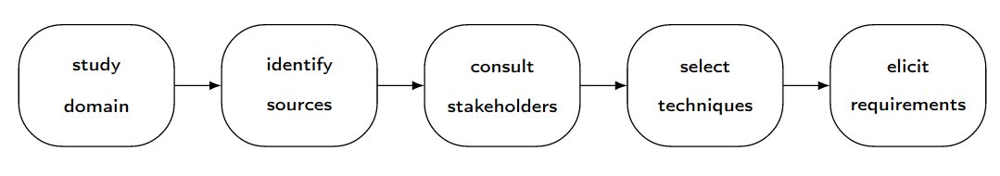
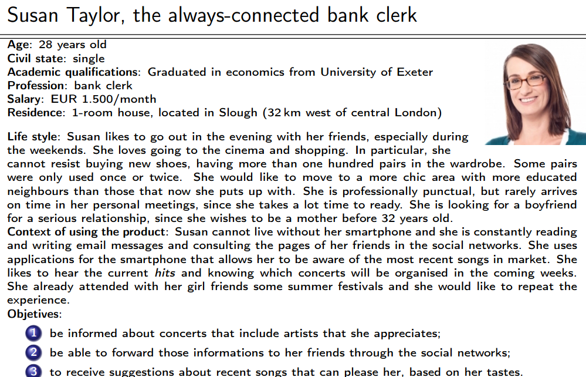

# Teórica 06

## Elicitação de Requisitos

### *Scope*

- A elicitação de requisitos permite a compreensão de quais são os requisitos de um dado sistema;
- Permite perceber as necessidades e expectativas dos *stakeholders* em relação ao produto;
- Estas atividades têm uma natureza comunicativa, o que envolve técnicas relacionadas às ciências sociais e teoria organizacional.

### Processo

- As atividades relacionadas a requisitos não devem ser exclusivas da fase inicial do ciclo de vida do projeto;
- A equipa de desenvolvimento deverá adotar uma abordagem que permita trabalhar com os requisitos em todo o ciclo de vida do projeto.

#### Tipo de Atividades

- Engenheiros de Requisitos intervêm em principalmente 2 tipos de atividades:
  - Contactam pessoas que têm um bom conhecimento acerca do problema, o que lhes permite identificar as restrições que poderão limitar a solução para o problema;
    - Caracterizada por um certo grau de incerteza e um aumento da informação e conhecimento relativo ao problema.
  - Preparam o documento de requisitos que descreverá o comportamento e as características expectáveis do sistema.
    - Caracterizada pela organização de ideias, a resolução de pontos de vista conflituosos e a eliminição de inconsistências e ambiguidades.

### Identificação dos *Stakeholders*

- São uma das principais fontes de informação durante o processo de elicitação;
- Um *system stakeholder* é alguém que tem algum tipo de interesse legítimo no sistema.
  - Poderá ser um grupo de pessoas ou organizações;
  - O termo é interesse é bastante vago, podendo resultar da utilização do sistema ou em algum tipo de responsabilidade relacionado ao sistema.

#### Funções

- Geralmente, o número de *stakeholders* de um projeto é elevado ($\geq 6$);
- A identificação dos *stakeholders* pode ser feita através da caracterização de funções ou posições existentes na organização;
- Alguns indivíduos poderão acumular diversas funções, o que provoca que seja necessário distinguir os indivíduos das suas funções.

#### Formas de Identificar

1. Perguntar ao cliente;
2. Examinar as posições da organização;
3. Comparar o produto com outros semelhantes;
4. Analisar o contexto do sistema;
5. Consultar os *stakeholders* que são facilmente encontrados na maioria dos sistemas.

#### Utilizador

- Qualquer pessoa que irá operar ou interagir diretamente com o sistema, quando este estiver em operação funcional no seu ambiente.
- Deve ser claramente identificado, visto que o sistema será desenvolvido para si;
- Deve ser dada prioridade aos utilizadores que irão interagir com o sistema mais frequentemente.

##### Particularidades

É recomendada a coleção de informações para compreender se existe alguma particularidade a ser registada para a interação com o sistema de algum dos seguintes grupos de pessoas:

- Deficientes ou de mobilidade reduzida;
- Com baixa nível de literacia;
- Não dominam a linguagem principal do sisteam;
- Com dificuldades visuais;
- Que transportam ou manuseiam substâncias e objetos;
- Com pouca habilidade para trabalhar com sistemas informáticos.

#### Cliente

- Entidade que encomenda e paga o desenvolvimento de um sistema;
- Geralmente, a encomenda é feita após uma negociação do preço com o produtor;
- Esta relação é, recorrentemente, formalizada através de um contrato;
- O cliente deverá ser providenciado com a documentação técnica completa que lhe permitirá a instalação e manutenção do sistema ao longo do seu ciclo de vida;
- Tem o poder para decidir acerca de diversos assuntos, nomeadamente o escopo, as funcionalidades e o custo;
- Nem sempre são utilizadores do sistema.

#### Comprador

- Alguém que paga para adquirir um sistema assim que este esteja pronto;
- São os maiores consumidores do sistema e este é construído à sua medida;
- Em muitos casos, o nome dos compradores sabe-se muito antes do início do desenvolvimento da aplicação;
- O ato de comprar não precisa de estar associado com uma transação financeira entre o comprador e o vendedor.

#### Segmento do Mercado

- Definido pela caracterização de necessidades ou comportamentos comuns dos compradores para os quais é orientado um dado um produto;
- O grupo de compradores representa um segmento do mercado se:
  - As suas necessidades exigem e justificam uma oferta diferente;
  - São abordados através de diferentes canais de distribuição;
  - Têm diferentes tipos de relações;
  - Têm níveis significativamente diferentes de lucro;
  - Estão dispostos a pagar por aspetos diferentes da oferta.

#### *Negative Stakeholder*

- Alguém que deseja que o sistema não seja desenvolvido;
- As suas atitudes podem variar de uma oposição pacífica a uma hostilidade ativa;
- A identificação de *negative stakeholders* poderá permitir a identificação de indivíduos que pretendam sabotar o desenvolvimento do sistema;
- A sua presença nas atividades de elicitação de requisitos é importante de forma a identificar e compreender as relações pessoais e políticas numa organização.

### Técnicas para elicitação de requisitos

#### Competências

- Competências genéricas necessárias para um engenheiro de requisitos:
  - **Questionar**: ser capaz de questionar as pessoas certas acerca dos requisitos;
  - **Observar**: observar os comportamentos dos utilizadores para com produtos existentes, sistemas ou processos, de forma a inferir as suas necessidades;
  - **Discutir**: argumentar com utilizadores acerca das suas necessidades, com o objetivo de formular uma compreensão acerca dos requisitos;
  - **Negociar**: facilitar a negociação entre os utilizadores de forma alcançar soluções aceitáveis acerca dos requisitos a serem incluídos, removidos ou alterados;
  - **Supor**: antecipar-se acerca das funcionalidades que os utilizadores poderão necessitar ou desejar, especialmente para a criação de produtos *mass-market*.

#### Grupos de Técnicas

- ***Marketing***: existe um interesse especial nos requisitos que contribuam para o sucesso comercial do sistema;
- **Psicologia e Sociologia**: enfatiza a satisfação das necessidades dos utilizadores, dos indíviduos e dos agentes sociais;
- ***Design* Participativo**: existe um envolvimento ativo por parte dos utilizadores na definição dos requisitos;
- **Fatores Humanos e Interação Pessoa-Máquina**: foco na interação dos utilizadores com o sistema;
- **Qualidade**: principal interesse na relação entre os requisitos e a qualidade do sistema;
- **Métodos Formais**: interesse na precisão e rigor matemático na especificação de requisitos.

Existem 3 grandes grupos de técnicas:

1. Individuais;
2. Grupos de Pessoas;
3. Artefactos.

#### Individuais

- Entrevistas;
- Estudos;
- Introspeção;
- Etnografia.

##### Entrevistas

- Não possuem regras exatas ou fórmulas, dando uma grande liberdade ao entrevistador;
- Por vezes, apresentam resultados de baixa qualidade;
- Devem ser conduzidas de forma estruturada para que apresentem bons resultados;
- O seu processo deve ser o seguinte:
  - Identificação dos entrevistados;
  - Preparação da entrevista;
  - Condução da entrevista;
  - Conclusão da entrevista.
- A identificação dos entrevistados incluirá alguns *stakeholders*;
- No mínimo, devem ser entrevistados o cliente e alguns utilizadores do sistema;
- Visto que não se poderá entrevistar todos os utilizadores de um produto, deve ser escolhida uma amostra representativa da comunidade de utilizadores para ser entrevistada;
- A identifcação dos entrevistados não precisa de ser finalizada antes do início da entrevista;
- É aceitável pedir opiniões acerca de outros indíviduos que deverão ser entrevistados.
- O entrevistador deverá explicar o contexto, os objetivos, a duração, os problemas a ser endereçados e a maneira como a informação da entrevista será tratada;
- Quando possível, modelos ou figuras podem ser utilizados de forma a encorajar o entrevistado a propôr alterações;
- Deverá ser utilizada, sempre que possível, a terminologia do problema.

##### Estudos

- É uma técnica que utiliza um questionário para colecionar informação com as respostas de diversos indivíduos;
- O seu processo deve ser o seguinte:
  - Identificar a audiência e os objetivos;
  - Conceber o questionário;
  - Escolher a amostra;
  - Recrutar participantes;
  - Conduzir o estudo.
- Quando o mesmo questionário é utilizado para todas as pessoas, torna-se possível o tratamento estatístico das respostas colecionadas;
- O sucesso é muito dependente da maneira como o questionário é concebido;
- Se as questões não estiverem bem focadas, forem mal formuladas ou aparecerem numa ordem errada, as respostas ao questionário poderão ser enganadoras;
- Deve evitar-se a utilização de questões negativas;
- Deve ser utilizada como uma técnica preliminar que irá ajudar na preparação das entrevistas.

##### Introspeção

- É a técnica mais básica, óbvia e rudimentar da elicitação de requisitos;
- O analista define os requisitos para um dado sistema baseado naquilo que pensa acerca das necessidades dos *stakeholders*;
- Muito utilizada, nomeadamente quando os engenheiros de requisitos têm um conhecimento vasto acerca do domínio do problema;
- Pode ser usada apenas como um ponto de partida para a adoção de outras técnicas de elicitação de requisitos.

#### Grupos

##### *Brainstorming*

- Facilita a geração de ideias;
- Congrega um grupo de 5 a 12 pessoas;
- O grupo sugere e explora o máximo de ideia possível, sem julgar ou criticar essas ideias;
- O seu processo deve ser o seguinte:
  - Geração de ideias;
  - Consolidação de ideias.

#### Artefactos

##### Análise do Domínio

- Análise da documentação e o estudo dos sistemas existentes é uma fonte de requisitos;
- É importante para obter um maior conhecimento acerca do domínio do problema;
- O objetivo é examinar o domínio em que o sistema se encontra, de forma a identificar elementos comuns em todos os sistemas desse domínio;
- Os artefactos do projeto atual devem ser guardados, de forma a ser possível o uso desta técnica no futuro.

##### Prototipagem

- Serve como mecanismo para capturar os requisitos;
- É baseada no seguinte processo iterativo:
  - Elicitação de Requisitos;
  - Construção de Protótipos;
  - Teste dos Protótipos;
  - Recomeça o processo.
- Assim que é considerado que os requisitos do cliente estão corretamente compreendidos, o protótipo é abandonado.

##### *Personas*

- Uma *persona* é uma pessoa fictícia que represente um tipo de utilizador importante no produto em desenvolvimento;
- É um arquétipo das pessoas que fazem parte da audiência alvo;
- É uma técnica de segmentação de mercado

- O seu processo deve ser o seguinte:
  - Identificar o problema;
  - Criar as personas;
  - Introduzir as personas;
  - Utilizar as personas;
  - Avaliar as personas.

