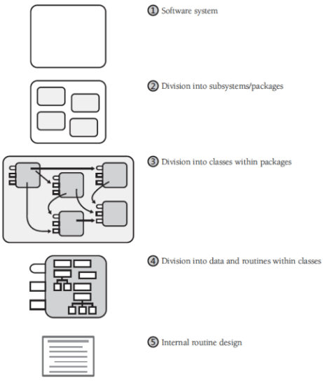
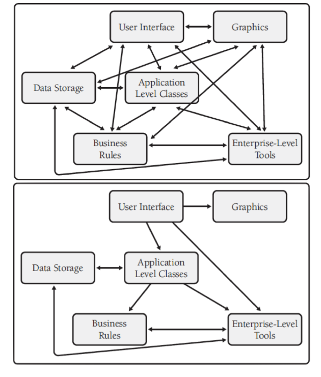
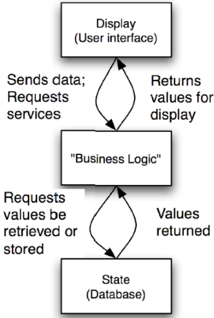

# Teórica 07

## Introdução à Arquitetura de *Software*

### Conceitos

#### Princípios

- É uma lei fundamental e compreensiva, doutrina ou assunção;
- Alguns princípios de *design* de *software* são noções chave que providenciam as bases para muitas abordagens ou conceitos:
  - Abstração;
  - Coesão e acoplamento;
  - Descomposição e modularização;
  - Encapsulamento e ocultação de informação;
  - Separação da interface e da implementação;
  - Suficiência, completude e primitivas;
  - Separação de preocupações.

#### *Design*

- *Software design* é um conceito ou invenção de um esquema para tornar uma especificação em *software* operacional;
- *Design* é a atividade que liga os requisitos à implementação em código e testes;
- Um bom *design top-level* providencia a estrutura que, de forma segura, contém múltiplos *designs* de *lower-level*;
- Um bom *design* é indispensável em grandes projetos.

#### Níveis de *Design*

#### Arquiteturas de *Software*

- As estruturas estáticas de um sistema define os seus elementos *design-time* internos e a sua disposição;
- As estruturas dinâmicas de um sistema define os seus elementos *run-time* e as suas interações;
- As propriedades fundamentais de um manifesto de sistema pode ser definido de duas formas:
  - Pelo seu comportamento visível externamente que define as suas interações funcionais entre o sistema e o seu ambiente;
  - A propriedade de qualidade que é uma propriedade não funcional.

##### Requisitos Funcionais e Arquitetura de *Software*

- A arquitetura tem emergido como uma parte crucial do processo de desenvolvimento;
- Uma arquitetura de *software* é o resultado de decisões de *design* tomadas cedo para decompor o sistema em partes;
- Requisitos funcionais não determinam arquiteturas.

##### O que é que afeta a arquitetura?

- As arquiteturas são influencidas por:
  - *Stakeholders*;
  - Organização do desenvolvimento;
  - O *background* e a experiência dos arquitetos;
  - O ambiente técnico.
- Uma arquitetura afeta os fatores que a influenciam;
- É o resultado de influências técnicas, de negócio e sociais;
- É acerca do *design* do sistema e o impacto nas suas qualidades;
- A arquitetura atua como o esqueleto do sistema, limita-o e afeta os seus atributos qualitativos.

#### Riscos

- Cada projeto irá enfrentar riscos, pelo que não há uma forma correta de fazer a arquitetura de *software*;
- Devem avaliar-se os riscos de cada projeto;
- Por vezes, é independente da arquitetura, visto que uma arquitetura que seja reutilizada já foi testada previamente;
- As escolhas a nível de arquitetura são mais importantes quando:
  - O espaço de soluções é pequeno;
  - O risco de falha é grande;
  - Há requisitos de atributos de qualidade difíceis de alcançar;
  - Está a ser considerado um novo domínio.

#### *Design* da arquitetura e *design* detalhado

- A fase de *design* pode ser particionada em duas fases:
  - ***Design* arquitetural**: partes macroscópicas do *design*, como os módulos e a forma como estes se conectam;
  - ***Design* detalhado**: tudo o resto.
- O *output* do *design* é:
  - um conjunto de artefactos que registam as decisões que foram tomadas;
  - o *rationale* para cada decisão não trivial é explicado.
- Cada sistema contém elementos e relações entre eles.

#### Dependências

- Cada componente tem uma função específica num sistema, sendo que irão colaborar entre si de forma a providenciar uma funcionalidade requerida;
- É importante minimizar as dependências entre componentes de forma a criar uma arquitetura pouco acoplada;
- Ao eliminar dependências desnecessárias, as mudanças são localizadas e não se propagam através do sistema;
- É necessário decidir como é que os componentes irão comunicar entre si e controlar a informação.

#### Acoplamento

### Boas Arquiteturas

#### Esqueletos

- Uma arquitetura de *software* com 3 patamares permite que os sistemas IT sejam capazes de localizar mudanças e gerir cargas transacionais;
- Uma arquitetura caracterizada por processos cooperativos é indicada para o desenvolvimento de sistemas operativos, uma vez que isola as falhas;
- É provável que uma rede distribuída VOIP (p.e. *Skype*) utilize uma arquitetura *peer-to-peer*.

#### Atributos de Qualidade

- Uma arquitetura de sistema tem o poder de providenciar ou retirar diversas qualidades, como segurança ou desempenho;
- Mudanças de requisitos funcionais são um desafio, no entanto, a evolução de atributos de qualidade pode forçar mudanças drásticas;
- Geralmente, a arquitetura requerá mais atenção em sistemas de larga escala ou elevada complexidade;
- As arquiteturas só podem ser avaliadas no contexto de objetivos estabelecidos;
- Existem, no entanto, certas *rules of thumb*.

#### A Arquitetura é Ortogonal à Funcionalidade

- Ambas podem ser balanceadas;
- Não há uma única arquitetura que seja melhor que as outras, mas algumas são mais indicadas para umas tarefas que outras;
- Um sistema pode ver a sua arquitetura a mudar, no entanto, deverá manter a sua funcionalidade;
- A mesma arquitetura pode ser utilizada num sistema com funcionalidades totalmente diferentes;
- Uma má escolha de arquitetura poderá tornar difícil alcançar os atributos de qualidade e as funcionalidades pretendidas.

#### O que torna uma arquitetura boa?

- Deve ser baseada numa lista de prioridade de atributos de qualidade;
- Deve ser documentada utilizando *views*;
- As *views* devem indicar os problemas dos *stakeholders* mais importantes;
- Deve ser avaliada pela sua habilidade de fornecer as qualidades mais importantes do sistema;
- Deve ser capaz de suportar uma implementação incremental

#### Arquiteturas *Presumptive*

- Família de arquiteturas que dominam um particular domínio;
- Desenvolvedores que nestes domínios optem por outras arquiteturas podem ter de justificar a sua escolha;
- Semelhantes a arquiteturas referenciais;
  - Uma arquitetura referencial é a família de arquiteturas que descreve a solução arquitetural para um dado problema.
- Têm sucesso porque são um bom *match* para os riscos comuns num domínio.