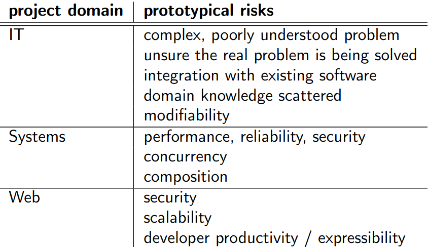
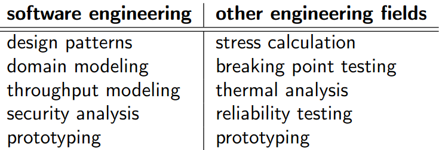

# Teórica 08

## Riscos Arquiteturais

### Abordagem Orientada aos Riscos

- Ajuda a desenvolver *software* de qualidade de forma rápida e barata;
- Permite que os arquitetos de *software* experimentem múltiplas arquiteturas;
- Ajuda a responder a 2 questões:
  - Quanto trabalho de arquitetura de *software* é preciso fazer?
  - Que técnicas é que devem ser utilizadas?
- Guia à aplicação de um conjunto mínimo de técnicas de arquitetura de forma a diminuir os riscos ligados à pressão nos arquitetos de *software*;
- Segue 3 passos:
  - Identifica e prioritiza riscos;
  - Seleciona e aplica um conjunto de técnicas;
  - Avalia a redução do risco.

### Riscos

- Em engenharia, riscos são conhecidos como a probabilidade de existir uma falha multiplicado pelo impacto;
$$ risk\ =\ probabilidade\ de\ falha \times impacto$$
- A probabilidade de falha e o impacto não são certos, visto que é muito difícil medi-los de forma precisa;
- Um risco pode existir (alguém o vê) mesmo que este não exista;
- Pode ser qualificado categoricamente, por vezes como uma falha de um atributo de qualidade necessário;
- Devem ser bem descritos, para que, posteriormente, possa ser testada a sua mitigação;

#### Protótipos de Riscos Comuns

#### Prioritização de Riscos

- Os riscos não são todos iguais, pelo que devem ser prioritizados. Muitas vezes, esta prioritização é feita com base numa discussão das prioridades entre os elementos das equipas;
- Os riscos podem ser caraterizados em duas grandes dimensões:
  - Com prioridade para os *stakholders* (**de negócio**);
  - Os desenvolvedores perceberam dificuldades (**de engenharia**);

#### Mitigação de Riscos

- As técnicas de mitigação de riscos são muito vastas, desde pura análise até puras soluções.
- Vejam-se algumas técnicas:

- É essencial que se seja capaz de explicitar como escolher as técnicas de forma a responder aos riscos;
- Para isso, pode criar-se uma espécie de manual com entradas no seguinte formato:
  - Se tivermos `nome do risco`, devemos considerar utilizar `nome da técnica` para o reduzir.
- De notar, que uma técnica poderá ser boa a reduzir alguns riscos, mas não outros, sendo que, idealmente, uma técnica singular deveria ser endereçada para resolver todos os riscos conhecidos;
- Alguns riscos podem ser mitigados utilizando algumas técnicas préviamente conhecidas, enquanto que, para outros, é necessário descobrir essas técnicas no momento.

#### Esforço proporcional aos riscos

- A abordagem orientada aos riscos utiliza o seguinte princípio:
  - Os esforços colocados na arquitetura devem ser proporcionais ao risco de falha.
- Assim, utilizando esta abordagem, a preocupação surgirá nas áreas em que riscos de falha são percetíveis.

### Estilos de *Design*

- *Evolutionary Design* (NDUF);
- *Planned Design* (BDUF);
- *Minimal Planned Design* (EDUF/LDUF).

#### *Evolutionary Design*

- O *design* do sistema cresce conforme o sistema é implementado;
- Práticas *agile* utilizadas para combater o "caos":
  - *Refactoring* ajuda a "limpar" locais de *design* não coordenados;
  - *Design* orietnado aos testes garante que as mudanças no sistema não provocam a perda ou a falha de funcionalidades já existentes;
  - Tem uma integração contínua e providencia a mesma *codebase* a toda a equipa.

#### *Planned Design*

- A arquitetura é detalhada antes da sua construção;
- Poucas pessoas defendem que se faça isto para todo um sistema;
- É útil para quando diversas equipas se encontram a trabalhar em simultâneo numa mesma arquitetura partilhada;
- Mesmo nesta abordagem, raramente se tem uma arquitetura a 100\% antes de se iniciar a prototipagem ou o código;
- O *design* pode ser aperfeiçoado com o *feedback* do código.

#### *Minimal Planned Design*

- Estilo híbrido das abordagens anteriores que permite o seu balanceamento;
- Uma forma de o fazer é, inicialmente, efetuar-se o *planned design* para garantir que a arquitetura é capaz de lidar com os grandes riscos do sistema e as alterações futuras aos requisitos podem ser tratadas através de um *design* local ou do *evolutionary design*;

#### Sumário dos Estilos de *Design*

- A abordagem *risk-driven* é compatível com os 3 estilos;
- Todos os estilos concordam que o *design* terá, obrigatoriamente, de acontecer em algum ponto;
  - No NDUF quando um risco é considerado suficientemente grande;
  - No BDUF numa fase inicial;
  - No LDUF é uma mistura dos dois anteriores.