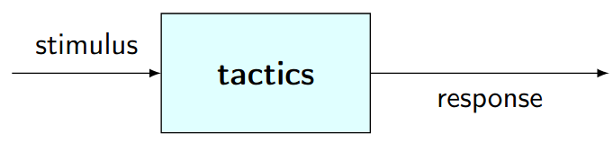
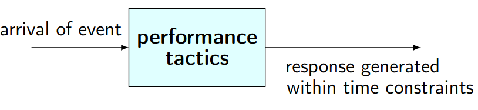

# Teórica 09

## Táticas de *Design*

- São utilizadas pelo arquiteto de *software* para criar um *design*;
- Conectam os requisitos de atributos de qualidade com decisões arquiteturais;
- São uma decisão de *design* que irá ter impacto sob atributos de qualidade específicos;

### Tipos de Táticas

- Táticas de Disponibilidade;
- Táticas de Modificabilidade;
- Táticas de Desempenho;
- Táticas de Segurança;
- Táticas de Testabilidade;
- Táticas de Usabilidade.

### Táticas de Disponibilidade

- Têm como alvo evitar que faltas se tornem falhas ou, pelo menos, reduzir os efeitos que uma falta poderá ter e repará-los o mais depressa possível;
- Muitas destas táticas estão disponíveis na execução *standard* dos sistemas;
- Todas as abordagem para endereçar disponibilidade involvem algum tipo de:
  - Redundância;
  - Monitorização para detetar falhas;
  - Recuperação quando uma falha é detetada.
- A monitorização e a recuperação tanto podem ser processos automáticos, como processo manuais.

#### Deteção de Falhas

- *Ping/echo*: um componente manda um *ping* e espera receber um *echo* como resposta do componente a analisar;
- *Heartbeat*: um componente emite, de forma periódica, uma mensagem *heartbeat* e outro componente ouve-a;
  - No caso de o *heartbeat* falhar, assume-se que o componente de origem falhou e o componente responsável pela correção de falhas é notificado.
- *Exceptions*: quando uma classe de falha é reconhecida lança-se uma *Exception*.

#### Recuperação de Falhas

- *Voting*: cada um dos processos a correr em processadores redundantes recebe o *input* e computaciona o *output* que envia a um *voter*;
  - Algoritmos populares são as regras de maioria e o componente favorito;
  - É utilizado para corrigir erros de operações de um algoritmo ou falhas de um processador.
- *Active Redundancy*: todos os componentes redundantes respondem aos eventos em paralelo;
  - Apenas é considerada a resposta de 1 componente (geralmente, o primeiro a responder), sendo as restantes descartadas.
- *Passive Redundancy*: um componente (primário) responde ao eventos e informa os outros componentes (*the standbys*) do estado das atualizações que estes devem fazer.
  - Quando uma falha ocorra, o sistem deverá, primeiramente, garantir que o estado de *backup* é suficiente recente antes de continuar os serviços.

#### Prevenção de Falhas

- *Removal from Service*: Remove um componente de operar em atividades que já se encontram a decorrer;
- *Transactions*: Agrupamento de múltiplos passos sequenciais que pode ser desfeito de uma vez;
  - Usados para evitar que dados sejam afetados se um passo do processo falhar;
  - Também evitam colisões de acesso a dados de múltiplas *threads* em simultâneo.
- *Process Monitor*: Sempre que uma falha num processo é detetada, o processo de monitorização pode apagar esse processo;
  - Posteriormente, é necessário criar uma nova instância desse processo.

### Táticas de Desempenho

#### Eventos

- Táticas de desempenho geram respostas a eventos do sistema num intervalo de tempo;
  - O evento poderá ser singular ou uma *stream* e será o gatilho para um pedido de computação de desempenho,
  - O sistema irá processar o evento e gerar uma resposta;
  - As táticas de desempenho irão controlar o tempo em que a resposta é gerada;
- A **latência** é o tempo entre o evento e a geração da resposta ao evento.

#### Consumo de Recursos e Tempo de Bloqueio

- Quando um evento acontece, o sistema deverá processá-lo ou estará bloqueado por algum motivo;
  - O consumo de recursos deve ser gerido;
  - O acesso a secções críticas deve ser sequencial;
- Existem três categorias de táticas relacionadas com o desempenho:
  - Demanda de recursos;
  - Gestão de recursos;
  - Recursos arbitrários. 

#### Demanda de Recursos

- As *streams* de eventos são a fonte das demandas de recursos;
- Tem 2 aspetos principais:
  - O tempo entre eventos numa *stream* de recursos;
  - Quantos recursos é que são consumidos por cada pedido.
- Uma tática que permite diminuir a latência é a redução dos recursos necessários para processar uma *stream*;
- Deve ainda aumentar-se a eficiência computacional utilizando os algoritmos adequados, sendo que uma melhoria no algoritmo deverá diminuir a latência;
- Por vezes, um recursos pode ser trocado por outro;
- Deve reduzir o *overhead* computacional, uma vez que se não existir pedidos para um dado recurso, o processamento será também menor;
- A utilização de nós intermediários irá aumentar o número de recursos consumidos, pelo que a sua remoção diminuirá a latência;
- Por fim, outra táticas para reduzir a latência passa por reduzir o número de eventos a serem processados.

#### Gestão de Recursos

- Introdução de concorrência: se os processos puderem ser tratados de forma paralela, então o *blocked time* será reduzido;
- Devem manter-se múltiplas cópias, tanto dos dados, como das computações. Clientes num padrão cliente-servidor são réplicas da computação.
  - Isto irá reduzir o nível de contenção, comparativamente ao caso em que todas as computações são executadas num servidor central;
  - Para diminuir a contenção, poderá ainda utilizar-se *caching*, mas as cópias dos dados devem ser consistentes e estar sincronizadas.
- O aumento dos recursos disponíveis (introdução de novos processadores, de mais memória, de processadores mais rápidos, etc...) irá, muito provavelmente, reduzir a latência.